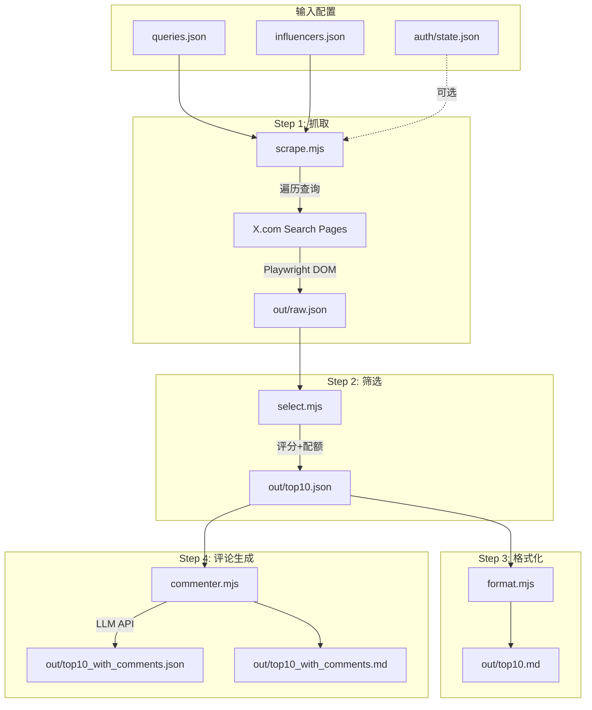

# X Radar 项目实施计划

## 1. 仓库文件结构与职责

```
x-radar/
├── package.json              # 依赖管理 + npm scripts
├── queries.json              # Pain/Reach 查询配置（含日语、中文关键词）
├── influencers.json          # KOL 账号列表和专属查询
├── src/
│   ├── scrape.mjs            # Playwright 抓取核心逻辑
│   ├── select.mjs            # Top10 筛选算法（评分+配额）
│   ├── format.mjs            # Markdown 输出生成
│   ├── commenter.mjs         # LLM 评论生成（3选项+中文解释）
│   ├── login.mjs             # 手动登录助手生成 auth state
│   └── utils.mjs             # 共享工具函数
├── auth/
│   └── .gitkeep              # 存放 state.json（已 gitignore）
├── out/
│   └── .gitkeep              # 输出目录（已 gitignore）
├── .github/
│   └── workflows/
│       └── x-radar.yml       # GitHub Actions 定时任务
├── .gitignore                # 忽略敏感文件和输出
└── README.md                 # 使用文档
```

### 各文件职责说明

| 文件 | 职责 |

|------|------|

| `queries.json` | 定义 pain 和 reach 两组查询，每条包含 group/name/query/max 字段 |

| `influencers.json` | KOL handles 数组 + 统一 query，用于 `from:handle query` 搜索 |

| `src/scrape.mjs` | 遍历所有查询，Playwright 打开搜索页，滚动加载，提取推文数据 |

| `src/select.mjs` | 合并去重，计算 ViralityScore + FiloFitScore，按配额选出 Top10 |

| `src/format.mjs` | 将 top10.json 转为运营友好的 Markdown 格式 |

| `src/commenter.mjs` | 调用 LLM 为每条推文生成 3 个回复选项（原语言+中文解释） |

| `src/login.mjs` | headful 模式打开 X，等待用户手动登录后保存 storageState |

| `src/utils.mjs` | 解析 engagement 数字（1.2K/3M）、语言检测、JSON 提取等 |

---

## 2. 数据流程图



### 三套输出文件完整结构

#### 1. out/raw.json (scrape.mjs 输出)

原始抓取数据，保留所有来源和推文。

```json
{
  "runAt": "2026-01-26T12:00:00Z",
  "stats": {
    "totalSources": 12,
    "totalTweets": 387,
    "byGroup": { "pain": 156, "reach": 189, "kol": 42 }
  },
  "sources": [
    {
      "group": "pain",
      "name": "gmail-spam-en",
      "query": "gmail spam -filter:retweets",
      "searchUrl": "https://x.com/search?q=...",
      "scrapedAt": "2026-01-26T12:01:23Z",
      "tweetCount": 45,
      "tweets": [
        {
          "url": "https://x.com/user/status/123456789",
          "author": "@user",
          "authorUrl": "https://x.com/user",
          "datetime": "2026-01-26T10:00:00Z",
          "text": "Gmail spam is out of control lately...",
          "likes": 45,
          "retweets": 12,
          "replies": 8,
          "rawLikesLabel": "45 Likes",
          "rawRetweetsLabel": "12 Retweets",
          "rawRepliesLabel": "8 replies"
        }
      ],
      "errors": []
    },
    {
      "group": "kol",
      "name": "kol-sama",
      "query": "from:sama (AI OR agent...) -filter:retweets",
      "searchUrl": "https://x.com/search?q=...",
      "scrapedAt": "2026-01-26T12:05:45Z",
      "tweetCount": 8,
      "tweets": [...]
    }
  ],
  "errors": [
    {
      "source": "gmail-spam-jp",
      "error": "Timeout waiting for tweets",
      "timestamp": "2026-01-26T12:03:12Z"
    }
  ]
}
```

#### 2. out/top10.json (select.mjs 输出)

筛选后的 Top 10 推文，含评分。

```json
{
  "runAt": "2026-01-26T12:00:00Z",
  "selectionStats": {
    "totalCandidates": 387,
    "uniqueAfterDedup": 312,
    "painSelected": 4,
    "reachSelected": 6,
    "backfilled": 0
  },
  "quota": { "pain": 4, "reach": 6, "total": 10 },
  "top": [
    {
      "rank": 1,
      "group": "reach",
      "sourceQuery": "ai-inbox-intersection",
      "url": "https://x.com/techuser/status/987654321",
      "author": "@techuser",
      "datetime": "2026-01-26T09:30:00Z",
      "text": "AI is finally making email manageable. The inbox noise problem is real...",
      "likes": 1200,
      "retweets": 340,
      "replies": 89,
      "viralityScore": 3213.5,
      "filoFitScore": 25,
      "textBonus": 5,
      "finalScore": 3243.5
    }
  ]
}
```

#### 3. out/top10_with_comments.json (commenter.mjs 输出)

带 LLM 生成评论的最终输出。

```json
{
  "runAt": "2026-01-26T12:00:00Z",
  "commentGenerationStats": {
    "total": 10,
    "succeeded": 9,
    "failed": 1,
    "byLanguage": { "en": 5, "ja": 3, "zh": 1 }
  },
  "top": [
    {
      "rank": 1,
      "group": "reach",
      "url": "https://x.com/techuser/status/987654321",
      "author": "@techuser",
      "datetime": "2026-01-26T09:30:00Z",
      "text": "AI is finally making email manageable...",
      "likes": 1200,
      "retweets": 340,
      "replies": 89,
      "finalScore": 3243.5,
      "detectedLanguage": "en",
      "comments": {
        "language": "en",
        "generatedAt": "2026-01-26T12:08:45Z",
        "options": [
          {
            "comment": "The inbox chaos is real. Been waiting years for AI to actually help here.",
            "zh_explain": "表达共鸣，轻松自然，暗示自己也在关注这个领域",
            "angle": "witty",
            "charCount": 78,
            "risk": "low"
          },
          {
            "comment": "This is exactly the problem worth solving - turning inbox noise into actionable signal. Curious what approach you're taking?",
            "zh_explain": "产品建设者视角，引发讨论，展示专业思考",
            "angle": "practical",
            "charCount": 124,
            "risk": "low"
          },
          {
            "comment": "The summarize + triage combo is key. Been building in this space - the hard part is knowing what actually matters to each person.",
            "zh_explain": "微妙产品角度，暗示在做相关产品但不推销，分享洞见",
            "angle": "subtle_product",
            "charCount": 131,
            "risk": "medium"
          }
        ]
      }
    },
    {
      "rank": 5,
      "group": "pain",
      "url": "https://x.com/jpuser/status/111222333",
      "author": "@jpuser",
      "text": "Gmailの迷惑メールフィルター、最近全然効かない...",
      "detectedLanguage": "ja",
      "comments": {
        "language": "ja",
        "options": [
          {
            "comment": "ほんとそれ。大事なメールまで迷惑メールに入っちゃうの最悪",
            "zh_explain": "日语共鸣回复，表达同样的痛苦体验",
            "angle": "witty",
            "charCount": 28,
            "risk": "low"
          }
        ]
      },
      "commentError": null
    },
    {
      "rank": 10,
      "url": "...",
      "comments": null,
      "commentError": "LLM API timeout after 3 retries"
    }
  ]
}
```

#### 4. out/top10.md (format.mjs 输出)

运营友好的 Markdown 格式。

```markdown
# X Radar Report
Generated: 2026-01-26T12:00:00Z

## Summary
- Total candidates: 312 (after dedup)
- Selected: 10 (pain: 4, reach: 6)

---

## Top 10 Tweets

### #1 [reach] @techuser
**Score:** 3243.5 | **Engagement:** 1.2K likes, 340 RTs, 89 replies
**Posted:** 2026-01-26 09:30 UTC

> AI is finally making email manageable. The inbox noise problem is real...

[View Tweet](https://x.com/techuser/status/987654321)

---

### #2 [pain] @frustrated_user
...
```

#### 5. out/top10_with_comments.md (commenter.mjs 输出)

带评论选项的最终 Markdown。

```markdown
# X Radar Report with Comments
Generated: 2026-01-26T12:00:00Z

---

## #1 [reach] @techuser
**Score:** 3243.5 | **Lang:** en
> AI is finally making email manageable...

[View Tweet](https://x.com/techuser/status/987654321)

### Reply Options:

**A) Witty** (78 chars, risk: low)
> The inbox chaos is real. Been waiting years for AI to actually help here.

中文解释: 表达共鸣，轻松自然，暗示自己也在关注这个领域

**B) Practical** (124 chars, risk: low)
> This is exactly the problem worth solving - turning inbox noise into actionable signal. Curious what approach you're taking?

中文解释: 产品建设者视角，引发讨论，展示专业思考

**C) Subtle Product** (131 chars, risk: medium)
> The summarize + triage combo is key. Been building in this space - the hard part is knowing what actually matters to each person.

中文解释: 微妙产品角度，暗示在做相关产品但不推销，分享洞见

---
```

---

## 3. 环境变量 / GitHub Secrets

### 本地开发环境变量 (.env 或直接 export)

- `LLM_API_URL` - OpenAI 兼容 API 端点（如 `https://api.openai.com/v1/chat/completions`）
- `LLM_API_KEY` - API 密钥
- `LLM_MODEL` - 模型名称（可选，默认 `gpt-4o-mini`）

### GitHub Secrets

| Secret 名称 | 必需 | 说明 |

|------------|------|------|

| `LLM_API_URL` | 是 | OpenAI 兼容端点 URL |

| `LLM_API_KEY` | 是 | API 密钥 |

| `LLM_MODEL` | 否 | 模型名，默认 `gpt-4o-mini` |

| `X_STORAGE_STATE_B64` | 否 | auth/state.json 的 base64 编码，用于绕过登录 |

### 生成 X_STORAGE_STATE_B64

```bash
# 本地登录后生成
npm run login
# 编码为 base64
base64 -i auth/state.json | tr -d '\n'
# 复制输出到 GitHub Secrets
```

---

## 4. npm scripts

**package.json scripts 定义:**

```json
{
  "scripts": {
    "login": "node src/login.mjs",
    "scrape": "node src/scrape.mjs",
    "select": "node src/select.mjs",
    "format": "node src/format.mjs",
    "comment": "node src/commenter.mjs",
    "run": "npm run scrape && npm run select && npm run format && npm run comment"
  }
}
```

### 本地运行命令

```bash
# 首次设置：生成登录状态
npm run login

# 完整流水线
npm run run

# 单步调试
npm run scrape   # 仅抓取 → out/raw.json
npm run select   # 仅筛选 → out/top10.json
npm run format   # 仅格式化 → out/top10.md
npm run comment  # 仅生成评论 → out/top10_with_comments.*
```

### CI 运行命令 (GitHub Actions)

```bash
npx playwright install --with-deps
npm run scrape
npm run select
npm run format
npm run comment
```

---

## 5. 选择器 / 抓取策略与故障处理

### DOM 选择器策略

| 数据 | 选择器 | 备注 |

|------|--------|------|

| 推文容器 | `article[data-testid="tweet"]` | 主要选择器 |

| 推文 URL | `a[href*="/status/"]` | 提取 href 属性 |

| 作者 | `div[data-testid="User-Name"] a `或从 URL 解析 | 取第一个 `@handle` |

| 时间 | `time[datetime]` | ISO 8601 格式 |

| 文本 | `div[data-testid="tweetText"]` | innerText |

| 回复数 | `button[data-testid="reply"]` | 从 aria-label 解析 |

| 转发数 | `button[data-testid="retweet"]` | 从 aria-label 解析 |

| 点赞数 | `button[data-testid="like"]` | 从 aria-label 解析 |

### Engagement 数字解析 (utils.mjs)

```
aria-label 格式示例:
- "12 replies" → 12
- "1,234 Likes" → 1234
- "1.2K Likes" → 1200
- "3.5M Retweets" → 3500000
```

解析逻辑:

1. 正则提取数字部分: `/[\d,.]+[KMB]?/i`
2. 移除逗号
3. 如有后缀 K/M/B，乘以相应倍数

### 滚动加载策略

```javascript
// 伪代码
for (let round = 0; round < 7; round++) {
  await page.evaluate(() => window.scrollTo(0, document.body.scrollHeight));
  await page.waitForTimeout(randomBetween(2000, 4500)); // 随机等待
  // 检查是否有新内容加载
}
```

- 滚动 6-8 轮
- 每轮随机等待 2-4.5 秒
- 设置总超时 90 秒防止无限等待

### 故障处理与降级策略

#### 故障场景一览表

| 场景 | 检测方式 | 处理方式 | 日志级别 |

|------|----------|----------|----------|

| 需要登录 | `[data-testid="loginButton"]` 或 URL 含 `/login` | 跳过该查询，记录警告 | WARN |

| 空结果 | `article` 数量为 0 | 记录后继续，source.tweets = [] | INFO |

| 选择器变更 | 关键元素 querySelector 返回 null | 字段设为 null，继续提取其他字段 | WARN |

| Rate Limit | 页面含 "Rate limit" 或 429 状态 | 等待 60s 后重试一次 | WARN |

| 网络超时 | Playwright timeout (30s) | 重试一次，仍失败则跳过 | ERROR |

| 验证码/挑战 | 检测 captcha/challenge 元素 | 立即跳过，记录需更新 auth | ERROR |

| LLM API 失败 | HTTP 错误或 JSON 解析失败 | 重试 3 次，仍失败则 comments=null | WARN |

#### 详细降级逻辑 (scrape.mjs)

```javascript
// utils.mjs - 日志工具
function log(level, message, data = {}) {
  const timestamp = new Date().toISOString();
  const prefix = { INFO: 'ℹ️', WARN: '⚠️', ERROR: '❌', DEBUG: '🔍' }[level];
  console.log(`${timestamp} ${prefix} [${level}] ${message}`, 
              Object.keys(data).length ? JSON.stringify(data) : '');
}

// scrape.mjs - 单个查询抓取（带降级）
async function scrapeSource(page, source) {
  const result = { ...source, scrapedAt: new Date().toISOString(), tweets: [], errors: [] };

  try {
    await page.goto(source.searchUrl, { timeout: 30000 });
    
    // 检测登录墙
    const loginButton = await page.$('[data-testid="loginButton"]');
    if (loginButton || page.url().includes('/login')) {
      log('WARN', 'Login required, skipping source', { name: source.name });
      result.errors.push({ type: 'LOGIN_REQUIRED', message: 'Login wall detected' });
      return result;  // 降级: 返回空结果，不崩溃
    }

    // 检测 Rate Limit
    const pageContent = await page.content();
    if (pageContent.includes('Rate limit')) {
      log('WARN', 'Rate limit detected, waiting 60s', { name: source.name });
      await page.waitForTimeout(60000);
      await page.reload();
    }

    await scrollAndLoad(page, source.max || 50);
    const articles = await page.$$('article[data-testid="tweet"]');
    
    for (const article of articles) {
      try {
        const tweet = await extractTweet(article);
        if (tweet.url) result.tweets.push(tweet);
      } catch (err) {
        log('WARN', 'Failed to extract tweet', { error: err.message });
        result.errors.push({ type: 'EXTRACT_FAILED', message: err.message });
      }
    }
    log('INFO', 'Source scraped', { name: source.name, count: result.tweets.length });
  } catch (err) {
    log('ERROR', 'Source scrape failed', { name: source.name, error: err.message });
    result.errors.push({ type: 'SCRAPE_FAILED', message: err.message });
  }
  return result;
}
```

#### 字段级提取降级

```javascript
async function extractTweet(article) {
  const tweet = { url: null, author: null, datetime: null, text: null, likes: 0, retweets: 0, replies: 0 };

  // 每个字段单独 try-catch，失败不影响其他字段
  try {
    const link = await article.$('a[href*="/status/"]');
    tweet.url = link ? await link.getAttribute('href') : null;
    if (tweet.url && !tweet.url.startsWith('http')) tweet.url = 'https://x.com' + tweet.url;
  } catch (e) { /* url 提取失败，保持 null */ }

  try {
    const timeEl = await article.$('time[datetime]');
    tweet.datetime = timeEl ? await timeEl.getAttribute('datetime') : null;
  } catch (e) { /* datetime 提取失败 */ }

  try {
    const textEl = await article.$('div[data-testid="tweetText"]');
    tweet.text = textEl ? await textEl.innerText() : null;
  } catch (e) { /* text 提取失败 */ }

  try {
    tweet.likes = await extractEngagement(article, 'like');
    tweet.retweets = await extractEngagement(article, 'retweet');
    tweet.replies = await extractEngagement(article, 'reply');
  } catch (e) { /* engagement 提取失败，保持 0 */ }

  // 从 URL 提取 author 作为备选
  if (tweet.url && !tweet.author) {
    const match = tweet.url.match(/x\.com\/([^/]+)\/status/);
    tweet.author = match ? `@${match[1]}` : null;
  }
  return tweet;
}
```

#### 选择器变更应对（备选选择器）

```javascript
const SELECTORS = {
  tweetContainer: ['article[data-testid="tweet"]', 'article[role="article"]'],
  tweetText: ['div[data-testid="tweetText"]', '[data-testid="tweetText"]', 'div[lang]'],
  likeButton: ['button[data-testid="like"]', 'button[aria-label*="Like"]']
};

async function $(el, selectors) {
  for (const sel of (Array.isArray(selectors) ? selectors : [selectors])) {
    const result = await el.$(sel);
    if (result) return result;
  }
  return null;
}
```

#### 空结果降级 (select.mjs)

```javascript
function selectTop10(rawData) {
  const allTweets = rawData.sources.flatMap(s => 
    s.tweets.map(t => ({ ...t, group: s.group === 'kol' ? 'reach' : s.group }))
  );

  if (allTweets.length === 0) {
    log('WARN', 'No tweets found across all sources');
    return {
      runAt: rawData.runAt,
      selectionStats: { totalCandidates: 0, warning: 'NO_TWEETS_FOUND' },
      top: []  // 返回空数组，不崩溃
    };
  }
  // 正常选择逻辑...
}
```

#### LLM API 失败降级 (commenter.mjs)

```javascript
async function generateComments(tweet, retries = 3) {
  for (let attempt = 1; attempt <= retries; attempt++) {
    try {
      const response = await fetch(process.env.LLM_API_URL, {
        method: 'POST',
        headers: { 'Authorization': `Bearer ${process.env.LLM_API_KEY}` },
        body: JSON.stringify({ model: process.env.LLM_MODEL || 'gpt-4o-mini', messages: [...] })
      });
      if (!response.ok) throw new Error(`HTTP ${response.status}`);
      
      const data = await response.json();
      const content = data.choices[0].message.content;
      const jsonMatch = content.match(/\{[\s\S]*\}/);
      if (!jsonMatch) throw new Error('No JSON found');
      return JSON.parse(jsonMatch[0]);
    } catch (err) {
      log('WARN', `LLM attempt ${attempt}/${retries} failed`, { error: err.message });
      if (attempt < retries) await new Promise(r => setTimeout(r, 2000 * attempt));
    }
  }
  log('ERROR', 'LLM generation failed after all retries', { tweet: tweet.url });
  return null;  // commentError 标记
}
```

#### 日志输出示例

```
2026-01-26T12:00:01Z ℹ️ [INFO] Starting scrape pipeline
2026-01-26T12:00:02Z ℹ️ [INFO] Loading auth state from auth/state.json
2026-01-26T12:00:35Z ℹ️ [INFO] Source scraped {"name":"gmail-spam-en","count":42}
2026-01-26T12:00:36Z ⚠️ [WARN] Login required, skipping source {"name":"gmail-spam-jp"}
2026-01-26T12:00:40Z ⚠️ [WARN] Failed to extract tweet {"error":"Selector not found"}
2026-01-26T12:01:15Z ❌ [ERROR] Source scrape failed {"name":"ai-agents-en","error":"Timeout"}
2026-01-26T12:02:00Z ℹ️ [INFO] Scrape complete {"totalSources":12,"totalTweets":287,"errors":3}
2026-01-26T12:02:01Z ℹ️ [INFO] Selection complete {"selected":10,"pain":4,"reach":6}
2026-01-26T12:02:30Z ⚠️ [WARN] LLM attempt 1/3 failed {"error":"HTTP 429"}
2026-01-26T12:03:00Z ❌ [ERROR] LLM generation failed after all retries {"tweet":"..."}
2026-01-26T12:03:01Z ℹ️ [INFO] Pipeline complete {"files":["raw.json","top10.json","top10.md"]}
```

### 登录状态管理 (login.mjs)

```javascript
// 伪代码流程
// 1. 以 headful 模式启动浏览器
// 2. 导航到 https://x.com/login
// 3. 控制台提示："请在浏览器中完成登录，然后按 Enter..."
// 4. readline 等待用户输入
// 5. 保存 context.storageState() 到 auth/state.json
// 6. 关闭浏览器
```

---

## 6. 查询配置详情

### queries.json 结构

```json
{
  "pain": [
    {
      "name": "gmail-spam-en",
      "query": "(gmail OR \"gmail app\" OR email OR inbox OR outlook) (spam OR notifications OR noise OR overload OR unsubscribe OR search OR \"can't find\") -filter:retweets",
      "max": 50
    },
    {
      "name": "gmail-spam-jp",
      "query": "(gmail OR メール OR 受信トレイ) (迷惑メール OR スパム OR 通知 OR 検索 OR 見つからない OR うざい OR 最悪) -filter:retweets",
      "max": 50
    },
    {
      "name": "gmail-spam-cn",
      "query": "(gmail OR 邮件 OR 邮箱 OR 收件箱) (垃圾邮件 OR 通知 OR 太多 OR 搜索 OR 找不到 OR 难用 OR 好烦) -filter:retweets",
      "max": 50
    },
    {
      "name": "inbox-triage-en",
      "query": "(\"inbox zero\" OR triage OR newsletter OR unsubscribe) (email OR inbox OR gmail) -filter:retweets",
      "max": 40
    },
    {
      "name": "inbox-triage-jp",
      "query": "(受信トレイ OR メルマガ OR 退会 OR 整理) (メール OR gmail) -filter:retweets",
      "max": 40
    }
  ],
  "reach": [
    {
      "name": "ai-agents-en",
      "query": "(\"AI agent\" OR agents OR \"AI assistant\" OR copilots OR automation OR productivity OR workflow OR \"second brain\") -filter:retweets",
      "max": 60
    },
    {
      "name": "ai-agents-jp",
      "query": "(AIエージェント OR 生産性 OR 自動化 OR 情報過多) -filter:retweets",
      "max": 50
    },
    {
      "name": "ai-inbox-intersection",
      "query": "(AI OR agent OR automation) (email OR inbox OR newsletters OR gmail OR outlook OR 通知 OR 受信トレイ OR メール) -filter:retweets",
      "max": 60
    }
  ]
}
```

### influencers.json 结构

```json
{
  "handles": ["elonmusk", "sama", "karpathy", "AndrewYNg", "lexfridman"],
  "query": "(AI OR agent OR productivity OR automation OR email OR inbox OR notifications)"
}
```

### KOL from: 抓取逻辑 (scrape.mjs)

**抓取流程:**

1. 读取 `influencers.json` 获取 handles 数组和 query
2. 为每个 handle 构建搜索 URL:
   ```
   https://x.com/search?q=from%3Aelonmusk%20(AI%20OR%20agent...)%20-filter%3Aretweets&f=live
   ```

3. 与普通查询使用相同的 Playwright 抓取逻辑
4. KOL 结果标记 `group: "kol"`，在 select 阶段归入 reach 配额

**伪代码:**

```javascript
// scrape.mjs 中的 KOL 抓取部分
const influencers = JSON.parse(fs.readFileSync('influencers.json'));
for (const handle of influencers.handles) {
  const kolQuery = `from:${handle} ${influencers.query} -filter:retweets`;
  const searchUrl = `https://x.com/search?q=${encodeURIComponent(kolQuery)}&f=live`;
  
  const tweets = await scrapePage(page, searchUrl, { max: 20 });
  sources.push({
    group: 'kol',           // 标记为 KOL 来源
    name: `kol-${handle}`,
    query: kolQuery,
    searchUrl,
    tweets
  });
}
```

**KOL 抓取特殊处理:**

- 每个 KOL 最多抓 20 条（避免单一来源占比过高）
- KOL 结果在 raw.json 中单独记录 `group: "kol"`
- select 阶段将 `kol` 归入 `reach` 配额计算

---

## 7. 评分与选择算法

### 评分公式

```javascript
ViralityScore = likes * 2 + retweets * 2 + replies * 1.5
FiloFitScore = countKeywordMatches(text, FILO_KEYWORDS) * 5
TextBonus = text.length > 20 ? 5 : 0
FinalScore = ViralityScore + FiloFitScore + TextBonus
```

### FiloFit 关键词集

```javascript
const FILO_KEYWORDS = {
  en: ['inbox', 'email', 'gmail', 'newsletter', 'notifications', 'noise', 
       'spam', 'summarize', 'summary', 'search', 'find', 'todo', 'task', 
       'triage', 'organize', 'overload', 'unsubscribe'],
  jp: ['メール', '受信トレイ', '通知', '迷惑メール', 'スパム', '検索', 
       '見つからない', '要約', 'タスク', '整理', 'メルマガ'],
  cn: ['邮箱', '收件箱', '通知', '垃圾邮件', '搜索', '找不到', 
       '总结', '待办', '任务', '整理', '降噪', '邮件']
};
```

### 配额选择逻辑 (select.mjs 核心算法)

**默认配额配置:**

```javascript
const QUOTA = {
  pain: 4,
  reach: 6,  // 包含 kol
  total: 10
};
```

**完整选择算法伪代码:**

```javascript
function selectTop10(allTweets) {
  // 1. 去重 (按 URL)
  const seen = new Set();
  const unique = allTweets.filter(t => {
    if (seen.has(t.url)) return false;
    seen.add(t.url);
    return true;
  });

  // 2. 计算评分
  const scored = unique.map(t => ({
    ...t,
    viralityScore: t.likes * 2 + t.retweets * 2 + t.replies * 1.5,
    filoFitScore: countKeywordMatches(t.text) * 5,
    textBonus: t.text?.length > 20 ? 5 : 0
  }));
  scored.forEach(t => {
    t.finalScore = t.viralityScore + t.filoFitScore + t.textBonus;
  });

  // 3. 分组 (kol 归入 reach)
  const painPool = scored.filter(t => t.group === 'pain')
                         .sort((a, b) => b.finalScore - a.finalScore);
  const reachPool = scored.filter(t => t.group === 'reach' || t.group === 'kol')
                          .sort((a, b) => b.finalScore - a.finalScore);

  // 4. 按配额选取
  const selected = [];
  const painPicked = painPool.slice(0, QUOTA.pain);
  const reachPicked = reachPool.slice(0, QUOTA.reach);
  selected.push(...painPicked, ...reachPicked);

  // 5. 回填逻辑
  const remaining = QUOTA.total - selected.length;
  if (remaining > 0) {
    // 如果 pain 不足，从 reach 剩余中补
    if (painPicked.length < QUOTA.pain) {
      const extraFromReach = reachPool.slice(QUOTA.reach, QUOTA.reach + remaining);
      selected.push(...extraFromReach);
    }
    // 如果 reach 不足，从 pain 剩余中补
    else if (reachPicked.length < QUOTA.reach) {
      const extraFromPain = painPool.slice(QUOTA.pain, QUOTA.pain + remaining);
      selected.push(...extraFromPain);
    }
  }

  // 6. 最终排序并截断
  return selected
    .sort((a, b) => b.finalScore - a.finalScore)
    .slice(0, QUOTA.total);
}
```

**回填示例场景:**

| 场景 | pain 候选 | reach 候选 | 最终结果 |

|------|-----------|------------|----------|

| 正常 | 10 | 15 | pain 4 + reach 6 = 10 |

| pain 不足 | 2 | 15 | pain 2 + reach 8 = 10 |

| reach 不足 | 10 | 3 | pain 7 + reach 3 = 10 |

| 两边都不足 | 2 | 3 | pain 2 + reach 3 = 5 |

| 完全无数据 | 0 | 0 | 空数组，记录警告 |

---

## 8. LLM 评论生成

### System Prompt 核心要点

```
你是一个帮助产品人员撰写 X 回复的助手。

规则:
1. 用推文的原始语言回复（如果无法判断则用英语）
2. 生成正好 3 个选项:
   A) 短而机智的回复
   B) 务实、产品建设者视角的回复
   C) 微妙的产品角度，不含 CTA；除非真的自然否则不提品牌名
3. 禁止: 链接、"下载"、CTA、敏感话题、侮辱、编造功能
4. 长度: 尽量 <= 220 字符
5. 输出严格 JSON 格式

输出 schema:
{
  "language": "en|ja|zh|other",
  "options": [
    {
      "comment": "回复内容",
      "zh_explain": "中文解释这条回复的意图和效果",
      "angle": "witty|practical|subtle_product",
      "risk": "low|medium|high"
    }
  ]
}
```

### 语言检测 (franc 库)

```javascript
import { franc } from 'franc';

const langCode = franc(text); // 返回 ISO 639-3 如 'eng', 'jpn', 'cmn'
const langMap = { eng: 'en', jpn: 'ja', cmn: 'zh', zho: 'zh' };
const detected = langMap[langCode] || 'other';
```

---

## 9. GitHub Actions Workflow

### .github/workflows/x-radar.yml 完整配置

```yaml
name: X Radar Pipeline

on:
  schedule:
    - cron: '0 */6 * * *'  # 每 6 小时: 00:00, 06:00, 12:00, 18:00 UTC
  workflow_dispatch:        # 手动触发

env:
  NODE_ENV: production

jobs:
  scrape-and-comment:
    runs-on: ubuntu-latest
    timeout-minutes: 30     # 防止无限挂起
    
    steps:
      # ===== 环境准备 =====
      - name: Checkout repository
        uses: actions/checkout@v4
      
      - name: Setup Node.js
        uses: actions/setup-node@v4
        with:
          node-version: '20'
          cache: 'npm'
      
      - name: Install dependencies
        run: npm ci
      
      - name: Install Playwright browsers
        run: npx playwright install chromium --with-deps
      
      # ===== 恢复 X 登录状态 (可选但推荐) =====
      - name: Restore X auth state
        if: ${{ secrets.X_STORAGE_STATE_B64 != '' }}
        run: |
          echo "Restoring auth state from secret..."
          echo "${{ secrets.X_STORAGE_STATE_B64 }}" | base64 -d > auth/state.json
          echo "Auth state restored: $(stat -c%s auth/state.json 2>/dev/null || stat -f%z auth/state.json) bytes"
      
      - name: Verify auth state (optional)
        if: ${{ secrets.X_STORAGE_STATE_B64 != '' }}
        run: |
          if [ -f auth/state.json ]; then
            echo "✓ auth/state.json exists"
          else
            echo "✗ auth/state.json missing - will run without login"
          fi
      
      # ===== 执行流水线 =====
      - name: Run scraper
        run: npm run scrape
        env:
          PLAYWRIGHT_HEADLESS: 'true'
        continue-on-error: false  # scrape 失败则整个流程停止
      
      - name: Run selector
        run: npm run select
        continue-on-error: false
      
      - name: Run formatter
        run: npm run format
        continue-on-error: false
      
      - name: Run comment generator
        run: npm run comment
        env:
          LLM_API_URL: ${{ secrets.LLM_API_URL }}
          LLM_API_KEY: ${{ secrets.LLM_API_KEY }}
          LLM_MODEL: ${{ secrets.LLM_MODEL || 'gpt-4o-mini' }}
        continue-on-error: true   # 评论失败不影响其他输出
      
      # ===== 输出诊断 =====
      - name: Show output summary
        if: always()
        run: |
          echo "=== Output Files ==="
          ls -la out/ || echo "No output directory"
          echo ""
          echo "=== raw.json stats ==="
          if [ -f out/raw.json ]; then
            node -e "const d=require('./out/raw.json'); console.log('Sources:', d.sources?.length, 'Tweets:', d.stats?.totalTweets)"
          fi
          echo ""
          echo "=== top10.json stats ==="
          if [ -f out/top10.json ]; then
            node -e "const d=require('./out/top10.json'); console.log('Selected:', d.top?.length)"
          fi
      
      # ===== 上传产物 =====
      - name: Upload artifacts
        if: always()  # 即使前面步骤失败也尝试上传已有输出
        uses: actions/upload-artifact@v4
        with:
          name: x-radar-${{ github.run_number }}-${{ github.run_attempt }}
          path: |
            out/raw.json
            out/top10.json
            out/top10.md
            out/top10_with_comments.json
            out/top10_with_comments.md
          retention-days: 30
          if-no-files-found: warn
```

### Secrets 配置详解

| Secret | 必需 | 说明 | 获取方式 |

|--------|------|------|----------|

| `X_STORAGE_STATE_B64` | 否* | Playwright storageState 的 base64 编码 | `npm run login` 后执行 `base64 -i auth/state.json \| tr -d '\n'` |

| `LLM_API_URL` | 是 | OpenAI 兼容 API 端点 | 如 `https://api.openai.com/v1/chat/completions` |

| `LLM_API_KEY` | 是 | API 密钥 | 从 OpenAI/其他提供商获取 |

| `LLM_MODEL` | 否 | 模型名称 | 默认 `gpt-4o-mini`，可设为 `gpt-4o` 等 |

*注: 无 `X_STORAGE_STATE_B64` 时抓取功能受限，可能返回空结果或被要求登录。

### 恢复 X_STORAGE_STATE_B64 的技术细节

```bash
# 1. 本地生成 state.json
npm run login
# 浏览器打开后手动登录 X，完成后在终端按 Enter

# 2. 编码为 base64 (macOS)
base64 -i auth/state.json | tr -d '\n' > /tmp/state_b64.txt

# 2. 编码为 base64 (Linux)
base64 -w 0 auth/state.json > /tmp/state_b64.txt

# 3. 复制内容到 GitHub Secrets
cat /tmp/state_b64.txt | pbcopy  # macOS
# 或手动复制 /tmp/state_b64.txt 内容

# 4. 在 GitHub 仓库设置 Secrets
# Settings → Secrets and variables → Actions → New repository secret
# Name: X_STORAGE_STATE_B64
# Value: 粘贴 base64 内容
```

### Workflow 恢复逻辑说明

```yaml
# 条件判断: 仅当 secret 存在时才恢复
if: ${{ secrets.X_STORAGE_STATE_B64 != '' }}

# base64 解码命令
echo "${{ secrets.X_STORAGE_STATE_B64 }}" | base64 -d > auth/state.json

# 验证文件大小 (跨平台兼容)
stat -c%s auth/state.json 2>/dev/null || stat -f%z auth/state.json
```

---

## 10. 端到端验证清单

### 本地开发验证

- [ ] `npm install` 无报错
- [ ] `npm run login` 能打开浏览器并保存 auth/state.json
- [ ] `npm run scrape` 生成 out/raw.json，至少有部分推文数据
- [ ] `npm run select` 生成 out/top10.json，条目数 <= 10
- [ ] `npm run format` 生成 out/top10.md，格式正确可读
- [ ] `npm run comment` 生成 out/top10_with_comments.json 和 .md
- [ ] `npm run run` 完整流水线无报错

### 数据质量验证

- [ ] raw.json 中 pain 和 reach 两组都有数据
- [ ] 日语/中文推文能正确抓取（非空 text）
- [ ] engagement 数字解析正确（K/M 后缀处理）
- [ ] top10.json 评分计算合理
- [ ] 配额逻辑正确（pain 4 + reach 6，有回退）
- [ ] 去重有效（无重复 URL）

### LLM 评论验证

- [ ] 每条推文生成 3 个回复选项
- [ ] 回复语言与原推文一致
- [ ] 中文解释 (zh_explain) 存在且有意义
- [ ] 无链接、CTA、品牌硬推

### GitHub Actions 验证

- [ ] workflow 文件语法正确
- [ ] 手动触发 (workflow_dispatch) 可运行
- [ ] Secrets 正确注入（检查日志无泄露）
- [ ] artifacts 成功上传并可下载
- [ ] 定时触发生效（等待下一个 cron 周期）

### 故障恢复验证

- [ ] 无 auth/state.json 时优雅降级（部分结果或空结果）
- [ ] 单个查询失败不影响其他查询
- [ ] LLM API 失败有重试或降级
- [ ] 空结果场景（无推文）不报错崩溃

### 安全验证

- [ ] auth/state.json 已在 .gitignore
- [ ] out/ 目录已在 .gitignore
- [ ] Secrets 不在日志中打印
- [ ] 无硬编码 API keys